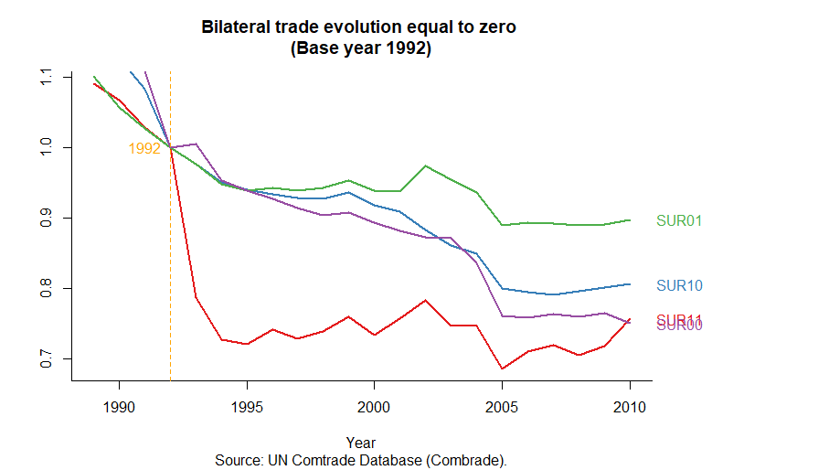

<!-- README.md is generated form README.Rmd. Please edit that file -->

```{r, include = FALSE}
library (zerotradeflow)

knitr::opts_chunk$set (
collapse = TRUE,
comment = "#",
fig.path = "figures/README-",
out.width = "100%"
)
```

# zerotradeflow

<!-- badges: start -->

[](https://github.com/AlexandreLoures/zerotradeflow/actions)
[](https://cran.r-project.org/package=zerotradeflow)
[](https://lifecycle.r-lib.org/articles/stages.html)
[](https://opensource.org/licenses/MIT)
[](https://github.com/AlexandreLoures/zerotradeflow/commit/main)
[](https://cran.r-project.org/package=zerotradeflow)
<!-- badges: end -->

`zerotradeflow` is a system for creating the bilateral trade flow between a country pair equal to zero. You provide the data, tell `zerotradeflow` which variables are of interest and it expands the base by creating the bilateral zero trade flow. The bases on the flow of trade between countries only report positive trade (greater than zero), however, for some analyzes of gravitacional models, data on zero flow is also necessary.

# Installation

To install the `package`, one of the two standard methods for installing `packages` in R can be adopted. Directly through the [cran](https://cran.r-project.org/package=zerotradeflow) (choosing the closest repository):

``` r
install.packages ("zerotradeflow")
```

Or the development version from GitHub:

``` r
# install.packages ("devtools")
devtools::install_github ("AlexandreLoures/zerotradeflow")
```

In the latter case, the latest version of the `package` will be installed.

# Usage

The operation of the `zerotradeflow` package consists of informing where the data are (the base) to be expanded and indicating the variables: year, exporting country, importing country, Harmonized Commodity Designation and Coding System (or other classification) and value of exports/imports. It takes into account that the order must be obeyed: data, year, exporter, importer, designation and coding and flow value.

# An application for Gravitational Models of Trade

First, like COMTRADE, BACI does not record the categories whose trade flow was equal to “zero”, which are obtained through the expansion of initial data (using the `zerotradeflow` package). Thus, for the eight countries in the sample there were initially 453,464 observations on bilateral trade and after expansion the number of observations totaled 1,527,680, ie 70.3% of the observations are “zeros”. With the replacement of the TRMS with the variant and invariant dummies in time, the model will total 355 explanatory variables.

The following methodological procedures are adopted: 1) use of a database with a high level of disaggregation allowing capturing the commercialization of new products; 2) it is assumed as returning a binary variable in which one represents a positive trade flow while zero characterizes the absence of trade or data censorship; 3) a treatment group composed of the full members of MERCOSUR (Brazil, Argentina, Paraguay, Uruguay and Venezuela) and  a control group formed by Bolivia, Chile and Peru and 4) the use of the Logit estimator with heteroscedasticity robust errors.

The data used in this analysis were extracted from the *Base pour l’Analyse du Commerce International* (BACI), from the *Center D’Estudes Prospectives Et D’Informations Internationales* (CEPII). This dataset is the basis on international trade that covers as many countries as possible and whose aggregation classification is called the four-digit Harmonized System (HS4), replacing the Standard Classification of International Trade (SITC) of four digits. The Harmonized System, created in 1988, is characterized as an international classification of goods based on codes and their respective descriptions whose objective is to promote the improvement of international trade, allowing comparisons and statistical analysis between countries as well as facilitating international negotiations (through standardization of information).

For simplicity and standardization, trade flows between members and non-members[^1] will be represented as follows: SUR11, SUR10, SUR00 and SUR01 where the first numeral represents the country of origin while the according to destination. Thus, SUR11 means that the exporter is a member of MERCOSUR as well as the importer, SUR10 the exporter is a member of MERCOSUR and in turn the importer is a non-member, SUR00 both the exporter and the importer are non-members of the MERCOSUR and SUR01 the exporter is a non-member and the importer is a member of MERCOSUR.



It can be seen from the figure above that the “zeros” of the commercial matrices of all trade flows (SUR11, SUR10, SUR01 and SUR00) have shown a downward trend since the late 1980s, which may be related to the globalization process , however the behavior of the variable SUR11 is different from the others. After the creation of MERCOSUR, what can be seen is a strong reduction in the number of “zeros”, mainly from 1992 onwards, resulting in a 30% drop in 1995. The behavior of the following periods is marked by some “peaks” and “valleys”. ” reaching in 2005 the highest level of reduction (33%). The control group for this variable, SUR00, also showed a downward trend in the period, however, it was more smooth (although in recent years it has been greater than that of MERCOSUR).

As a robustness test, the behavior of the variable SUR01 was analyzed, verifying, in the figure above, that, like the others, this curve showed a downward trend, but it was the smoothest movement of all the curves, demonstrating that it was MERCOSUR and not other reasons that caused the reduction in the number of “zeros”. Regarding the variable SUR10, it is noted that MERCOSUR also boosted exports from members to non-members.

It is important to note that a portion of the “zeros” in BACI are censored data, as transactions less than US$ 1,000 are not accounted for in international trade and, therefore, the “zeros” can represent both the absence of trade as well as data censorship. .

## Reference

* Loures and Figueiredo (2019). **Mercosul e o efeito *spillover* na criação de comércio**. doi: <a href="https://doi.org/10.11606/1980-5330/ea150797" target="_blank" rel="noopener noreferrer">10.11606/1980-5330/ea150797</a>

* Figueiredo and Loures (2016). **O efeito do Mercosul sobre a comercialização de novos produtos**. doi: [10.5935/0034-7140.20160015](<https://doi.org/10.5935/0034-7140.20160015>){target="_blank"}


[^1]: Non-members are represented by the control group, ie, Bolivia, Chile, and Peru.


<!--
[](https://cran.r-project.org/package=covid19brazil) 
 
[](https://cran.r-project.org/package=covid19brazil)

[](https://cran.r-project.org/package=covid19brazil)

[](https://cran.r-project.org/package=covid19brazil)

# Installation

[](https://cran.r-project.org/package=covid19italy)

[](https://cran.r-project.org/package=covid19italy)
-->
